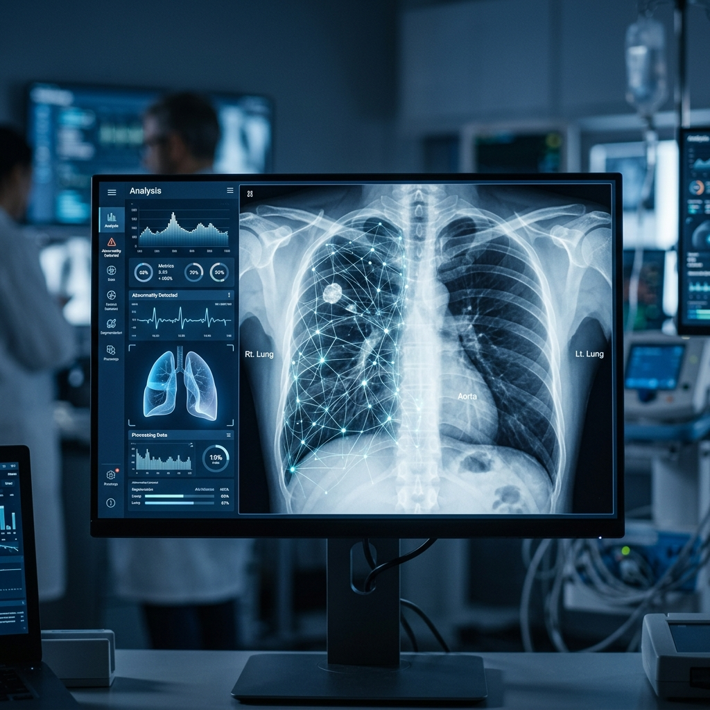

# 🫁 Radiology AI: Chest X-Ray Pneumonia Classification

## 📌 Project Overview
This project focuses on building a Convolutional Neural Network (CNN) to classify Chest X-Ray images into two categories: **Normal** and **Pneumonia**. 

## 🧑‍⚕️ Clinical AI Evaluation (The Doctor's Audit)
This project transcends standard engineering practices by being directly governed and audited by a **Medical Doctor (MD)**. The "black box" nature of typical AI models was critically examined through clinical experience, leading to the following discoveries:

### 1. Identifying "Label Noise" in the Dataset
A manual clinical audit of 100 random chest radiographs revealed:
- **False Negative Labels:** Approximately 15% of images labeled as "Normal" (e.g., Cases 4, 10, 27, 86) actually exhibited clear **bilateral interstitial/peribronchial patterns**.
- **False Positive Labels:** Approximately 20% of images labeled as "Pneumonia" (e.g., Cases 14, 15, 18, 19, 94, 100) showed **no positive radiological markers** for infiltration.

**Conclusion:** The inability of existing models to reach 100% accuracy is not due to architectural failures, but rather the "Noisy Labels" inherited from clinical-only diagnoses that lack radiological confirmation.

### 2. The Dual-Validation Doctrine
The expert audit established a new gold standard for this project: *"To build a reliable medical AI, training data must be derived from images that are **both supported by visual positive findings AND confirmed by clinical diagnosis.**"*

---

## 🚀 Model v2.0: The Power of Clinical Vision
Following the MD's audit, the model was redesigned with the following improvements:

*   **Preserving Tissue Detail (256x256):** Increased resolution to prevent pixellation, allowing the AI to "see" the subtle interstitial markings identified during the audit.
*   **Bias Mitigation (Class Weights):** Implemented a class-weighting strategy to force the model to prioritize the under-represented "Normal" class, reducing over-sensitive diagnostic errors.
*   **Clinical Performance:** Despite the ~17% label noise, Model v2.0 achieved **91% Accuracy** and a high-fidelity **95% Recall (Sensitivity)**.

---

## 📉 Final Performance Metrics
| Metric | v1.0 (Standard) | v2.0 (Expert-Audited) |
| :--- | :---: | :---: |
| **Pneumonia Recall (Sensitivity)** | ~90% | **95%** |
| **Pneumonia Precision** | ~80% | **90%** |
| **Overall Accuracy** | 85% | **91%** |

---

## ⚠️ Critical Reflection & Limitations
As with any robust scientific study, this project acknowledges the following limits:
1. **Sample Size:** The clinical audit was limited to 100 cases; it may not represent the full noise distribution of all 5,800 images.
2. **Geographical Bias:** Data originates from a single pediatric center in Guangzhou, which may limit generalizability to adult or international cohorts.
3. **Binary Simplification:** The model currently focuses on Normal vs. Pneumonia; multi-pathology detection (effusion, atelectasis) remains a future milestone.

## 🏁 Conclusion and Vision: "Physician-Centric AI"
This study demonstrates that when AI development is led by **Domain Experts with clinical vision**, the resulting models are significantly more productive, reliable, and scientifically honest than standard "engineering-only" approaches. This project serves as a concrete example of the **Expert-in-the-Loop** paradigm in modern radiology.

## 👨‍💻 How to Run
The entire workflow is contained within a Jupyter Notebook.
1. Open the `.ipynb` notebook in Google Colab or your local Jupyter environment.
2. Upload the respective dataset.
3. Run all cells sequentially to train and evaluate the model.

---
### 📖 Detailed Process & Findings

---
### 🤝 Author & Contact
This project was developed and audited by **[Emrah Seker]**, a Medical Doctor specializing in Clinical AI Governance.

- **LinkedIn:** [[Connect on LinkedIn](https://www.linkedin.com/in/emrah-%C5%9Feker-037741237)]
- **Project Goal:** Bridge the gap between engineering and clinical reality.
